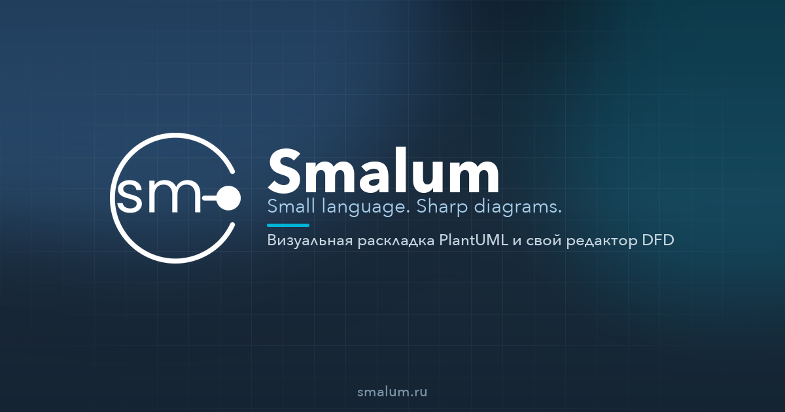

<h1 align="center">
  
  
  Smalum
</h1>

<strong>Small language. Sharp diagrams.</strong>

  <a href="https://smalum.ru">Сайт</a> ·
  <a href="https://app.smalum.ru">Редактор</a> ·
  <a href="https://docs.smalum.ru">Документация</a>

**Smalum** — редактор диаграмм как код.

PlantUML, Mermaid, BPMN, DFD и SQL остаются исходником. Раскладка живёт в комментариях `SM:` и не сгорает при следующем разборе: координаты уезжают вместе с файлом.

Развиваем **Web IDE** для диаграмм как код: тот же исходник, что в git и в markdown, открывается, правится и доводится до сдачи.

  

## Зачем

Пишете схему текстом — как в репозитории. На холсте готовите картинку к ревью, ТЗ или слайду. Следующая правка исходника не откатывает раскладку.

Гость работает без аккаунта. PNG, SVG и файл с оверлеем `SM:` — бесплатно.

## Для кого

Системные аналитики, архитекторы, разработчики и технические писатели, которым схема — сдача, а не одноразовая иллюстрация.

## Этот GitHub

Здесь — публичные плагины и пакеты (VS Code, Obsidian, `@smalum/*`).  
Редактор — веб-приложение: **[app.smalum.ru](https://app.smalum.ru)**.

## English

Smalum is a diagrams-as-code editor for PlantUML, Mermaid, BPMN, DFD and SQL. Layout lives in `SM:` comments and survives the next parse. We are building a Web IDE around that source — the same code you keep in git.

[smalum.ru](https://smalum.ru) · [app](https://app.smalum.ru) · [docs](https://docs.smalum.ru)

---

[dev@smalum.ru](mailto:dev@smalum.ru)
